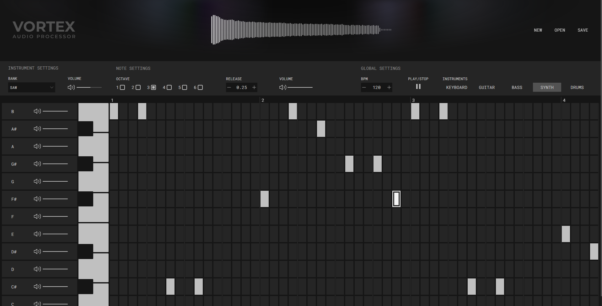

# VORTEX 🎛️
**A high-performance, browser-based digital audio workstation and sequencer.**

[](https://vortex-ruby-psi.vercel.app/)

VORTEX is a fully-featured audio sequencer built for the modern web. It allows users to sequence multiple instruments (Bass, Drums, Guitar, Keyboard, and Synth) in real-time, backed by a highly optimized audio engine and rendering pipeline.

[🔗 **Try the Live Demo Here**](https://vortex-ruby-psi.vercel.app/)



---

## ✨ Features

* **Multi-Track Sequencing:** Dedicated tracks for Keyboard, Guitar, Bass, Synth, and Drums with customizable BPM and playback settings.
* **Real-Time Audio Visualizer:** A 60fps, zero-memory-allocation HTML5 Canvas visualizer that dynamically reacts to the audio context without bottlenecking the CPU.
* **Persistent State Management:** Complex audio and UI states are handled gracefully across multiple tracks.
* **Native File Management:** Save and open your sequences as `.json` project files directly to/from your local machine utilizing the Web File System Access API (with native Blob fallbacks for Firefox/Safari).
* **Studio-Grade UI:** A sleek, hardware-inspired dark UI.

---

## 🛠️ Tech Stack

* **Frontend Framework:** React + TypeScript + Vite
* **State Management:** Zustand
* **Audio Engine:** [Strudel.js](https://strudel.cc/) & Web Audio API
* **Graphics & Performance:** HTML5 Canvas API & ResizeObserver (Retina/High-DPI support)
* **Styling:** Tailwind CSS

---

## 📖 The Architecture & Performance Rebuild (V2)

VORTEX is a complete ground-up redesign of an older audio sequencer project. The primary goal of this rebuild was addressing significant technical debt, UI/UX clutter, and performance bottlenecks.

### Key Engineering Upgrades:
1. **Rendering Performance:** The V1 project used D3.js and raw DOM elements for audio visualization, causing severe CPU spikes and memory leaks due to rapid garbage collection. VORTEX replaces this with a heavily optimized, primitive-based `<canvas>` loop that bypasses DOM layout calculations entirely, ensuring smooth 60fps rendering even on lower-end devices.
2. **State Management Redesign:** Transitioned to **Zustand** to decouple the complex audio grid logic from React's render cycle, allowing for isolated store states per instrument and seamless JSON serialization.
3. **Audio Routing:** Monkey-patched standard Web Audio API node connections to successfully route dynamic, real-time audio streams generated by Strudel.js directly into the visualizer's `AnalyserNode`.

---

## 🚀 Getting Started for Local Development

To run this project locally on your machine:

**1. Clone the repository:**
```bash
git clone [https://github.com/YOUR-USERNAME/vortex.git](https://github.com/YOUR-USERNAME/vortex.git)
cd vortex
```

**2. Install dependencies:**
```bash
npm install
```

**3. Start the development server:**
```bash
npm run dev
```

**4. Open in browser:**
Navigate to `http://localhost:5173`

---

## 📄 License

This project is open-source and available under the [MIT License](LICENSE).